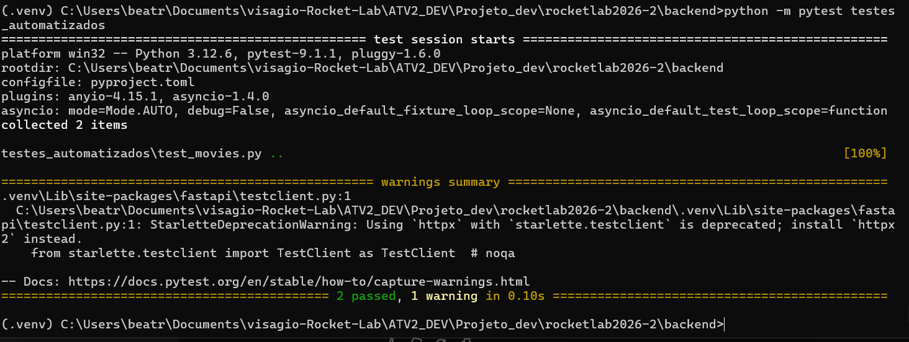
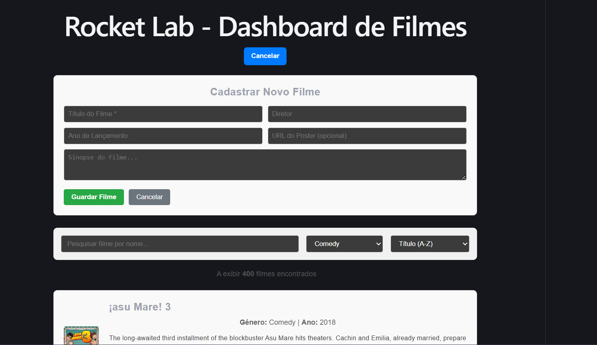
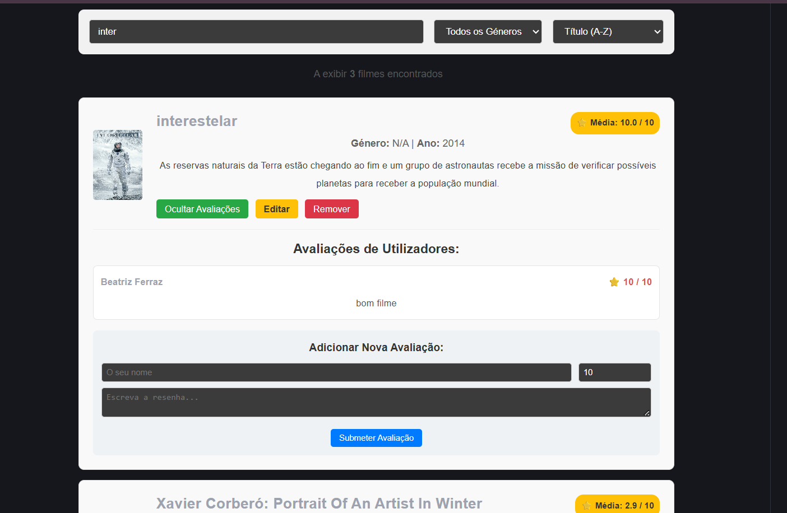
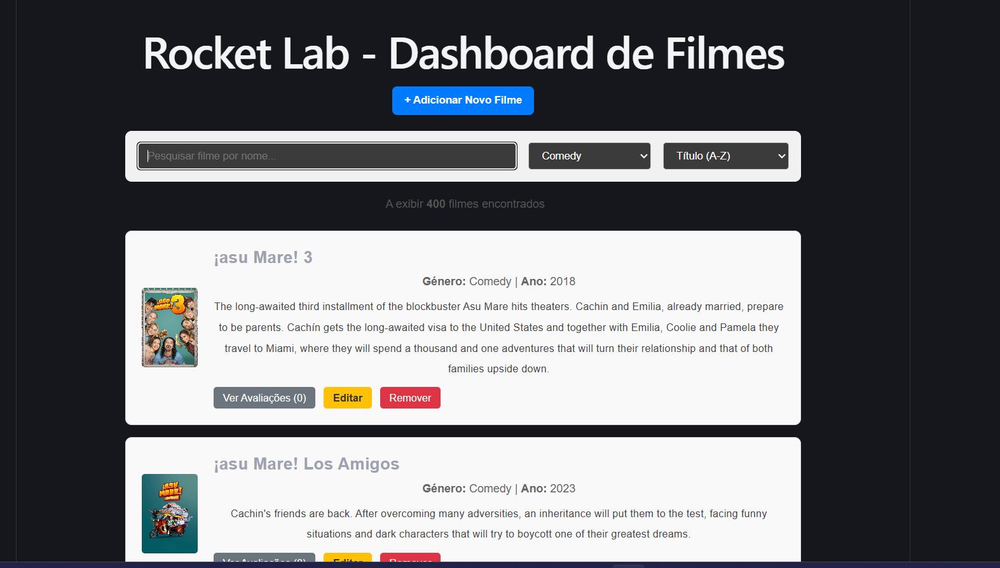

# RocketLab 2026.2 — repositório base

# 🎬 Rocket Lab - Dashboard de Filmes

Repositório completo para a atividade do RocketLab, contendo a API backend em FastAPI e a interface frontend em React (TypeScript).

---

## 📂 Estrutura do Projeto

```text
.
├── backend/
│   ├── app/
│   │   ├── api/v1/         # Rotas e endpoints da API
│   │   ├── core/           # Configurações e logging
│   │   ├── db/             # Base ORM, engine e sessões
│   │   └── movies/         # Modelos SQLAlchemy do domínio de filmes
│   ├── migrations/         # Ambiente e revisões Alembic
│   └── tests/              # Testes automatizados (pytest)
├── frontend/
│   ├── src/
│   │   ├── componentes/    # Componentes React (MovieList, MovieForm, etc.)
│   │   ├── services/       # Comunicação com a API (movieService.ts)
│   │   └── types/          # Tipagens TypeScript
└── README.md

## Execução

Requer Python 3.11 ou superior.

## Banco de dados e migrações

O modelo usa um esquema estrela para o catálogo de filmes:

- dimensões de filmes, gêneros, pessoas, produtoras e resumo de avaliações;
- fato de desempenho financeiro e de engajamento;
- tabelas de associação N:N entre filmes, gêneros, produtoras e pessoas;

O schema corresponde aos nove arquivos CSV atuais da camada Diamond, com a
adição de `movie_reviews`: uma avaliação individual por linha, na escala 0–10.
A tabela aceita diretamente as colunas `sk_movie_review_id`, `sk_movie_id`,
`nome`, `nota` e `comentario` do CSV enviado separadamente. `created_at` é
gerado pelo banco. O contexto generativo não faz parte desta base.

O repositório não inclui CSVs nem rotinas de carga. Para usar avaliações,
importe primeiro os filmes em `dim_movies` e depois o CSV de `movie_reviews`.

As tabelas são criadas exclusivamente pelo Alembic. Para evoluir os modelos,
crie uma revisão e aplique-a:

```bash
cd backend
.venv/bin/alembic revision --autogenerate -m "descreva a alteração"
.venv/bin/alembic upgrade head
```

O banco padrão é SQLite local em `backend/rocketlab.db`. 

## 🛠️ Como Executar o Projeto Localmente
Requer Python 3.11+ e Node.js instalados.

### 1. Configurar e Executar o Backend
Abra um terminal na pasta `backend`:
```bash
cd backend
python3 -m venv .venv
.venv/bin/pip install -e ".[dev]"
cp .env.example .env
.venv/bin/alembic upgrade head
.venv/bin/uvicorn app.main:app --reload

```
A API mínima ficará disponível em `http://localhost:8000`; use
`http://localhost:8000/docs` para a documentação automática. O endpoint
`GET /health` permite conferir se a aplicação iniciou corretamente.


### 1. 2. Configurar e Executar o Frontend:
```bash
cd frontend

# Instalar dependências
npm install

# Iniciar o servidor de desenvolvimento
npm run dev

```
O frontend abrirá no link fornecido pelo Vite (geralmente http://localhost:5173).

## 🧪 Testes Automatizados

O projeto conta com uma suíte de **testes automatizados de integração** para garantir a estabilidade e a qualidade das rotas do backend (FastAPI) antes de novas implementações.

### 🛠️ Tecnologias e Ferramentas Utilizadas
* **Pytest**: Framework principal de execução de testes.
* **TestClient (Starlette/HTTPX)**: Para simular requisições HTTP diretamente na API.
* **SQLite (em memória com Aiosqlite)**: Base de dados isolada e volátil executada exclusivamente durante os testes, garantindo rapidez e evitando alterações na base de dados real.

### 📋 O que é testado?
1. **Listagem vazia (`test_list_movies_empty`)**: Verifica se o endpoint de busca retorna corretamente um array vazio quando a base de dados está limpa.
2. **Criação de filmes (`test_create_movie`)**: Valida o envio de dados via método `POST`, confirmando o cadastro correto e o retorno adequado dos dados do filme criado.
### 📋 O que é testado?
3. **Listagem com dados (`test_list_movies_with_data`)**: Insere um filme de teste na base de dados e valida se a listagem (`GET`) consegue recuperá-lo com sucesso.


### 🚀 Como executar os testes
Certifique-se de que o ambiente virtual está ativado e execute o seguinte comando na pasta raiz do backend:

```bash
python -m pytest testes_automatizados

```


* **Teste_executado**: Na captura acima temos a execucção bem sucedida do file do teste automtizado implementado.

## ✨ Funcionalidades da Aplicação

* **Backend Robusto**: Arquitetura FastAPI com esquema estrela via SQLAlchemy e migrações geridas pelo Alembic.
* **Gestão de Filmes**: Listagem, criação, edição e remoção de filmes.
* **Filtros e Ordenação**: Pesquisa por nome em tempo real, filtro por gêneros e ordenação dinâmica (Título e Ano).
* **Avaliações (Reviews)**: Visualização e envio de avaliações por filme.
* **Polimento de UX**: Estados de carregamento amigáveis, contador de filmes encontrados e tratamento para listas vazias.



* **Cadastro de filmes**: Na imagem podemos ver um espaço dedicado ao cadastro de novos filmes na base de dados.


* **Cadastro de filmes/reviews**: Na imagem podemos ver que foi possível cadastrar um novo filmes na base de dados (Interestelar), além disso também vemos o cadastro de reviews em novos filmes do banco funcionando corretamente e um espaço dedicado para novas reviews serem inseridas.



* **Uso de filtros**: Na imagem podemos ver que foi possível fazer uma pesquisa por filtros de gêneros dos filmes, sendo o print uma captura da busca por filmes de comédia.


